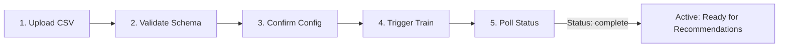

# Developer Integration Guide: Multi-Tenant Recommendations & Onboarding API

Welcome to the **AI_POD Recommendations API**! This guide is designed for external engineering teams integrating with our multi-tenant recommendation platform. You should be able to integrate and make your first production recommendation request in **under 30 minutes**.

---

## Table of Contents
1. [Obtaining an API Key](#1-obtaining-an-api-key)
2. [Authentication](#2-authentication)
3. [The Onboarding Flow](#3-the-onboarding-flow)
   - [Step 1: Upload Dataset (`POST /v1/onboard/upload`)](#step-1-upload-dataset-post-v1onboardupload)
   - [Step 2: Validate & Profile Schema (`POST /v1/onboard/validate`)](#step-2-validate--profile-schema-post-v1onboardvalidate)
   - [Step 3: Confirm Configuration (`POST /v1/onboard/confirm`)](#step-3-confirm-configuration-post-v1onboardconfirm)
   - [Step 4: Trigger Asynchronous Training (`POST /v1/onboard/train`)](#step-4-trigger-asynchronous-training-post-v1onboardtrain)
   - [Step 5: Poll Training Status (`GET /v1/onboard/status`)](#step-5-poll-training-status-get-v1onboardstatus)
4. [The Recommendations Flow](#4-the-recommendations-flow)
5. [Rate Limiting](#5-rate-limiting)
6. [Error Handling & Status Codes](#6-error-handling--status-codes)
7. [Minimal, Complete Code Examples](#7-minimal-complete-code-examples)
   - [Python Example](#python-example)
   - [JavaScript / Node.js Example](#javascript--nodejs-example)

---

## 1. Obtaining an API Key

API keys are tenant-isolated credentials formatted as `sk-<tenant>-<random_string>` (for example, `sk-telco-8f92a10b4c3e`).

### How to Request Your Key
1. **Contact the Platform Admin**: Send an onboarding request to the platform operations team with:
   - Your company/organization name
   - Desired tenant identifier (e.g., `acme_retail`, `fintech_corp`)
   - Primary technical contact email
   - Expected request volume (queries per minute)
2. **Key Provisioning**: The administrator provisions your tenant mapping in the platform's secure vault (AWS SSM Parameter Store / Secrets Manager in production, or local configuration during development).
3. **Storage Best Practices**:
   - Store your key in an environment variable (e.g. `RECOMMENDATIONS_API_KEY`).
   - Never commit API keys to version control.
   - Restrict access to backend services; do not expose your API key in client-side code (browsers or mobile applications).

---

## 2. Authentication

All requests to tenant-scoped endpoints require the `X-API-Key` HTTP header.

```http
X-API-Key: sk-acme-xxxx
```

> **Security Note**: Your organization's tenant context is **always resolved cryptographically from the API key**. Client-supplied query parameters or request body tenant IDs cannot override or spoof another tenant's data.

### Example Authentication cURL Request

```bash
curl -X GET "https://api.yourdomain.com/v1/recommendations?customer_id=CUST-10492&top_n=5" \
  -H "X-API-Key: sk-acme-8f92a10b4c3e" \
  -H "Accept: application/json"
```

If the header is omitted or invalid, the API rejects the request immediately:

```json
{
  "detail": "API key is missing. Provide a valid 'X-API-Key' header."
}
```

---

## 3. The Onboarding Flow

Before receiving personalized recommendations, new organizations onboard their raw tabular data (customers, products, and historic interactions or subscriptions) through our 5-step automated workflow.



---

### Step 1: Upload Dataset (`POST /v1/onboard/upload`)
Upload your raw CSV data. You can supply the file as a JSON payload (`csv_content`) or as raw text/csv.

#### Request
```bash
curl -X POST "https://api.yourdomain.com/v1/onboard/upload" \
  -H "X-API-Key: sk-acme-8f92a10b4c3e" \
  -H "Content-Type: application/json" \
  -d '{
    "csv_content": "user_id,tenure_months,subscription_plan,monthly_spend,cloud_storage,security_pack\nusr_001,14,Pro,49.99,Yes,No\nusr_002,2,Basic,19.99,No,No\nusr_003,36,Enterprise,199.99,Yes,Yes\nusr_004,8,Pro,49.99,Yes,Yes\nusr_005,21,Enterprise,199.99,Yes,Yes\n"
  }'
```

#### Response (`200 OK`)
```json
{
  "tenant_id": "acme_retail",
  "file_path": "data/raw/acme_retail_raw.csv",
  "rows": 5,
  "columns": [
    "user_id",
    "tenure_months",
    "subscription_plan",
    "monthly_spend",
    "cloud_storage",
    "security_pack"
  ],
  "message": "Successfully uploaded 5 rows and 6 columns for tenant 'acme_retail'."
}
```

---

### Step 2: Validate & Profile Schema (`POST /v1/onboard/validate`)
Profiles the uploaded dataset, automatically classifies customer features, interaction targets, and products, and generates a proposed configuration block.

#### Request
```bash
curl -X POST "https://api.yourdomain.com/v1/onboard/validate" \
  -H "X-API-Key: sk-acme-8f92a10b4c3e" \
  -H "Content-Type: application/json" \
  -d '{}'
```

#### Response (`200 OK`)
```json
{
  "tenant_id": "acme_retail",
  "is_valid": true,
  "candidate_config": {
    "data_source": {
      "type": "csv",
      "path": "data/raw/acme_retail_raw.csv"
    },
    "customers": {
      "id_column": "user_id",
      "features": [
        {"name": "tenure_months", "type": "numeric"},
        {"name": "subscription_plan", "type": "categorical"},
        {"name": "monthly_spend", "type": "numeric"}
      ]
    },
    "products": {
      "catalog_source": "derived_from_services",
      "category_column": "category"
    },
    "interactions": {
      "customer_id_column": "user_id",
      "services": [
        {"source": "cloud_storage", "maps_to_product": "cloud_storage"},
        {"source": "security_pack", "maps_to_product": "security_pack"}
      ],
      "positive_values": ["Yes", "true", "1"]
    },
    "segmentation": {
      "field": "tenure_months",
      "split": "median"
    }
  },
  "needs_review": [],
  "summary": "Profile complete. Inferred 'user_id' as Customer ID; 2 numeric features, 1 categorical feature; 2 service interaction targets."
}
```

---

### Step 3: Confirm Configuration (`POST /v1/onboard/confirm`)
Approve the candidate configuration generated in Step 2. You can also supply custom column overrides if needed.

#### Request
```bash
curl -X POST "https://api.yourdomain.com/v1/onboard/confirm" \
  -H "X-API-Key: sk-acme-8f92a10b4c3e" \
  -H "Content-Type: application/json" \
  -d '{
    "candidate_config": {
      "data_source": {
        "type": "csv",
        "path": "data/raw/acme_retail_raw.csv"
      },
      "customers": {
        "id_column": "user_id",
        "features": [
          {"name": "tenure_months", "type": "numeric"},
          {"name": "subscription_plan", "type": "categorical"},
          {"name": "monthly_spend", "type": "numeric"}
        ]
      },
      "products": {
        "catalog_source": "derived_from_services",
        "category_column": "category"
      },
      "interactions": {
        "customer_id_column": "user_id",
        "services": [
          {"source": "cloud_storage", "maps_to_product": "cloud_storage"},
          {"source": "security_pack", "maps_to_product": "security_pack"}
        ],
        "positive_values": ["Yes", "true", "1"]
      },
      "segmentation": {
        "field": "tenure_months",
        "split": "median"
      }
    }
  }'
```

#### Response (`200 OK`)
```json
{
  "tenant_id": "acme_retail",
  "status": "confirmed",
  "config_saved": true,
  "message": "Configuration for tenant 'acme_retail' successfully saved to config.yaml."
}
```

---

### Step 4: Trigger Asynchronous Training (`POST /v1/onboard/train`)
Training typically takes 10 to 60+ seconds depending on data volume. To prevent HTTP timeout errors, this endpoint dispatches training to a background worker and returns **`202 Accepted`** immediately.

#### Request
```bash
curl -X POST "https://api.yourdomain.com/v1/onboard/train" \
  -H "X-API-Key: sk-acme-8f92a10b4c3e" \
  -H "Content-Type: application/json" \
  -d '{}'
```

#### Response (`202 Accepted`)
```json
{
  "tenant_id": "acme_retail",
  "status": "queued",
  "status_url": "/v1/onboard/status",
  "message": "Training job for tenant 'acme_retail' accepted and queued in background.",
  "trained": false,
  "model_path": null
}
```

---

### Step 5: Poll Training Status (`GET /v1/onboard/status`)
Poll this endpoint every 2–5 seconds until `status` transitions to `"complete"` (or `"failed"`).

#### Request
```bash
curl -X GET "https://api.yourdomain.com/v1/onboard/status" \
  -H "X-API-Key: sk-acme-8f92a10b4c3e"
```

#### Response While Running (`200 OK`)
```json
{
  "tenant_id": "acme_retail",
  "status": "running",
  "has_data": true,
  "has_config": true,
  "has_model": false,
  "model_path": null,
  "error": null,
  "message": "Training job for tenant 'acme_retail' is running."
}
```

#### Response Upon Completion (`200 OK`)
```json
{
  "tenant_id": "acme_retail",
  "status": "complete",
  "has_data": true,
  "has_config": true,
  "has_model": true,
  "model_path": "models/acme_retail/final_model.joblib",
  "error": null,
  "message": "Model successfully trained and saved to models/acme_retail/final_model.joblib for tenant 'acme_retail'."
}
```

#### Response If Training Fails (`200 OK`)
If training fails (e.g. malformed values or missing columns), the exact reason is captured in the `error` attribute:
```json
{
  "tenant_id": "acme_retail",
  "status": "failed",
  "has_data": true,
  "has_config": true,
  "has_model": false,
  "model_path": null,
  "error": "Dataset formatting corrupt: expected column 'user_id' not found in row 4",
  "message": "Training failed for tenant 'acme_retail': Dataset formatting corrupt: expected column 'user_id' not found in row 4"
}
```

---

## 4. The Recommendations Flow

Once your tenant status is `complete` (or `active`), you can query personalized recommendations for any known customer.

### Endpoint: `GET /v1/recommendations`

#### Query Parameters
| Parameter | Type | Required | Default | Description |
| :--- | :--- | :---: | :---: | :--- |
| `customer_id` | `string` | **Yes** | — | Unique identifier of the target customer. |
| `top_n` | `integer` | No | `5` | Maximum number of recommended items to return. |

#### Request
```bash
curl -X GET "https://api.yourdomain.com/v1/recommendations?customer_id=usr_001&top_n=3" \
  -H "X-API-Key: sk-acme-8f92a10b4c3e" \
  -H "Accept: application/json"
```

#### Response (`200 OK`)
```json
{
  "tenant_id": "acme_retail",
  "customer_id": "usr_001",
  "recommendations": [
    {
      "item_id": "security_pack",
      "score": 0.8924,
      "rank": 1
    },
    {
      "item_id": "cloud_storage",
      "score": 0.3411,
      "rank": 2
    }
  ],
  "count": 2,
  "engine": "learned_ranking"
}
```

> **Note**: An alternative `POST /v1/recommendations` endpoint is also supported if you prefer sending JSON bodies: `{"customer_id": "usr_001", "top_n": 3}`.

---

## 5. Rate Limiting

To guarantee quality of service across all organizations, rate limits are enforced on a per-tenant sliding window basis.

### Default Limits
- **Recommendations (`GET /v1/recommendations`)**: `60` requests per minute
- **Onboarding & Training (`/v1/onboard/*`)**: `5` requests per minute

*(Custom enterprise tiers with higher burst and sustained quotas are available upon request).*

### Exceeding the Quota: `429 Too Many Requests`
When your tenant exceeds the allowed rate limit:
1. The server returns HTTP status code `429`.
2. A `Retry-After` header is included, indicating the number of seconds to wait before retrying.
3. A JSON error message provides quota details.

#### Example `429` Response Headers
```http
HTTP/1.1 429 Too Many Requests
Content-Type: application/json
Retry-After: 34
```

#### Example `429` Response Body
```json
{
  "detail": "Rate limit exceeded for tenant 'acme_retail' (limit: 60 req/min for recommendations). Retry in 34 seconds."
}
```

#### Recommended Backoff Strategy
Always read the `Retry-After` header and wait for the specified period before making another request:
```python
if response.status_code == 429:
    wait_seconds = int(response.headers.get("Retry-After", 5))
    time.sleep(wait_seconds)
```

---

## 6. Error Handling & Status Codes

The API uses standard HTTP response status codes. Every client error (4xx) and server error (5xx) returns a JSON body with a `"detail"` string describing the failure.

| Status Code | Reason | Meaning & Troubleshooting |
| :---: | :--- | :--- |
| **`200 OK`** | Success | Request succeeded. Expected JSON response returned. |
| **`202 Accepted`** | Asynchronous Task | Request accepted and queued in the background (used by `POST /v1/onboard/train`). Poll `status_url` for completion. |
| **`400 Bad Request`** | Invalid Input | Malformed JSON, empty `customer_id`, blank CSV upload, or invalid configuration parameters. Inspect `"detail"`. |
| **`401 Unauthorized`** | Auth Failure | Missing or unknown `X-API-Key` header. Verify your API key credential. |
| **`404 Not Found`** | Resource Missing | Customer ID does not exist in tenant data, raw dataset not uploaded, unconfirmed tenant config, or model artifact missing. |
| **`429 Too Many Requests`** | Rate Limit Exceeded | Tenant has exceeded the requests-per-minute quota. Inspect the `Retry-After` header and back off. |
| **`500 Internal Error`** | System Error | Unexpected internal server failure. Contact platform support if persistent. |

### Example Error Responses

#### Empty Customer ID (`400 Bad Request`)
```json
{
  "detail": "customer_id query parameter cannot be empty"
}
```

#### Unknown Customer (`404 Not Found`)
```json
{
  "detail": "Customer 'usr_99999' not found in dataset for tenant 'acme_retail'"
}
```

---

## 7. Minimal, Complete Code Examples

### Python Example

A complete, production-ready Python client with automatic `Retry-After` backoff:

```python
"""Example client integration with AI_POD Recommendations API."""

import os
import time
import requests

API_BASE_URL = os.environ.get("RECOMMENDATIONS_API_BASE", "http://localhost:8000")
API_KEY = os.environ.get("RECOMMENDATIONS_API_KEY", "sk-telco-xxxx")


def get_recommendations(customer_id: str, top_n: int = 5, max_retries: int = 3) -> dict:
    """Fetch top-N personalized recommendations for a customer.

    Handles authentication, 429 rate limit backoff, and error reporting.
    """
    url = f"{API_BASE_URL}/v1/recommendations"
    headers = {
        "X-API-Key": API_KEY,
        "Accept": "application/json",
    }
    params = {
        "customer_id": customer_id,
        "top_n": top_n,
    }

    for attempt in range(max_retries):
        response = requests.get(url, headers=headers, params=params, timeout=10)

        # 1. Success
        if response.status_code == 200:
            return response.json()

        # 2. Rate Limited (429) -> Respect Retry-After
        if response.status_code == 429:
            retry_after = int(response.headers.get("Retry-After", 5))
            print(f"[Rate Limited] Backing off for {retry_after}s (attempt {attempt + 1}/{max_retries})...")
            time.sleep(retry_after)
            continue

        # 3. Known Client & Server Errors
        if response.status_code in (400, 401, 404, 500):
            error_msg = response.json().get("detail", response.text)
            raise RuntimeError(f"API Error ({response.status_code}): {error_msg}")

        response.raise_for_status()

    raise TimeoutError("Exceeded max retries due to persistent rate limiting.")


if __name__ == "__main__":
    # Replace with a valid customer ID for your tenant
    target_customer = "7590-VHVEG"

    print(f"Fetching recommendations for customer: {target_customer}...")
    try:
        result = get_recommendations(customer_id=target_customer, top_n=3)
        print("\n--- Recommendations Received ---")
        print(f"Tenant:   {result['tenant_id']}")
        print(f"Engine:   {result['engine']}")
        print(f"Customer: {result['customer_id']}")
        for item in result["recommendations"]:
            print(f"  #{item['rank']}: Item {item['item_id']} (Confidence Score: {item['score']:.4f})")
    except Exception as exc:
        print(f"Error fetching recommendations: {exc}")
```

---

### JavaScript / Node.js Example

A complete Node.js snippet using standard `fetch`:

```javascript
// recommendations_client.js
const API_BASE_URL = process.env.RECOMMENDATIONS_API_BASE || 'http://localhost:8000';
const API_KEY = process.env.RECOMMENDATIONS_API_KEY || 'sk-telco-xxxx';

async function getRecommendations(customerId, topN = 5, retries = 3) {
  const url = new URL(`${API_BASE_URL}/v1/recommendations`);
  url.searchParams.append('customer_id', customerId);
  url.searchParams.append('top_n', topN);

  for (let attempt = 0; attempt < retries; attempt++) {
    const res = await fetch(url, {
      method: 'GET',
      headers: {
        'X-API-Key': API_KEY,
        'Accept': 'application/json',
      },
    });

    if (res.status === 200) {
      return await res.json();
    }

    if (res.status === 429) {
      const retryAfter = parseInt(res.headers.get('Retry-After') || '5', 10);
      console.warn(`[Rate Limited] Waiting ${retryAfter}s before retrying...`);
      await new Promise((resolve) => setTimeout(resolve, retryAfter * 1000));
      continue;
    }

    const errorBody = await res.json().catch(() => ({ detail: res.statusText }));
    throw new Error(`API Error (${res.status}): ${errorBody.detail || 'Unknown error'}`);
  }

  throw new Error('Exceeded max retries due to rate limiting.');
}

// Example invocation
(async () => {
  try {
    const customerId = '7590-VHVEG';
    const data = await getRecommendations(customerId, 3);
    console.log(`Recommendations for ${data.customer_id}:`);
    data.recommendations.forEach((rec) => {
      console.log(`  #${rec.rank} ${rec.item_id} (score: ${rec.score})`);
    });
  } catch (err) {
    console.error('Request failed:', err.message);
  }
})();
```

---

## 8. Summary Checklist for Integration

- [ ] **Provisioning**: Secured your tenant API key from the platform administrator.
- [ ] **Authentication**: Configured your HTTP client to pass the `X-API-Key` header with every request.
- [ ] **Data Readiness**: Verified tenant onboarding is complete (`GET /v1/onboard/status` returns `"complete"` or `"active"`).
- [ ] **Resilience**: Implemented 429 rate limit backoff using the `Retry-After` header.
- [ ] **Validation**: Handled 404 responses for unknown or inactive customer IDs gracefully.
