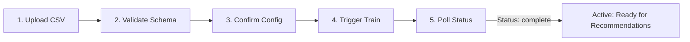
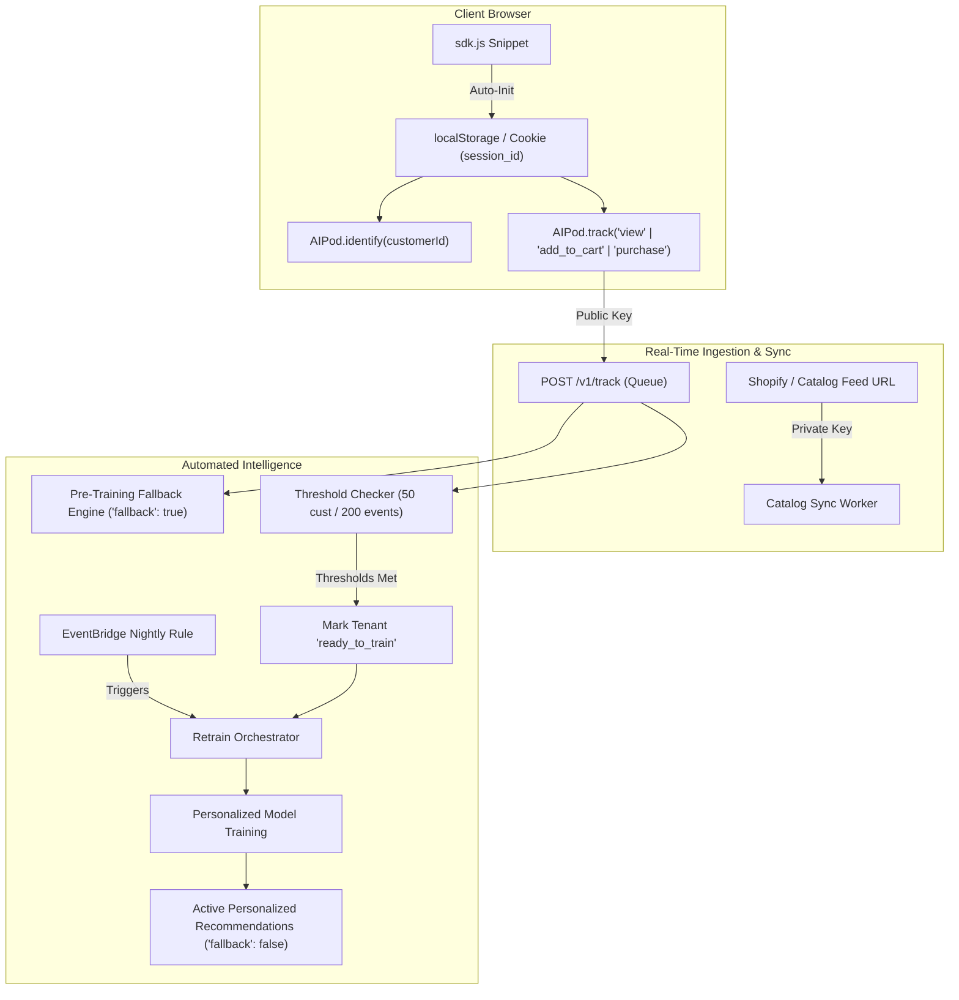

# Developer Integration Guide: Multi-Tenant Recommendations & Onboarding API

Welcome to the **AI_POD Recommendations API**! This guide is designed for external engineering teams integrating with our multi-tenant recommendation platform. You should be able to integrate and make your first production recommendation request in **under 30 minutes**.

---

## Table of Contents
1. [Obtaining API Keys (Private vs Public)](#1-obtaining-api-keys-private-vs-public)
2. [Authentication](#2-authentication)
3. [The Onboarding Flow (Batch CSV Upload)](#3-the-onboarding-flow-batch-csv-upload)
4. [The Fully-Automated Integration Path (Web SDK & Continuous ML)](#4-the-fully-automated-integration-path-web-sdk--continuous-ml)
   - [4.1 Private vs Public Keys](#41-private-vs-public-keys)
   - [4.2 Web SDK Snippet & Tracking Instrument Points](#42-web-sdk-snippet--tracking-instrument-points)
   - [4.3 Connecting Store Platforms & Catalog Feeds](#43-connecting-store-platforms--catalog-feeds)
   - [4.4 Automated Lifecycle: Fallbacks, Thresholds & Retraining](#44-automated-lifecycle-fallbacks-thresholds--retraining)
   - [4.5 Privacy, Cookie Notice & Visitor Consent](#45-privacy-cookie-notice--visitor-consent)
5. [The Recommendations Flow](#5-the-recommendations-flow)
6. [Rate Limiting](#6-rate-limiting)
7. [Error Handling & Status Codes](#7-error-handling--status-codes)
8. [Minimal, Complete Code Examples](#8-minimal-complete-code-examples)
9. [Summary Checklist for Integration](#9-summary-checklist-for-integration)

---

## 1. Obtaining API Keys (Private vs Public)

AI_POD provisions **pairs of cryptographically distinct API keys** for every tenant:

| Key Type | Prefix | Intended Environment | Permitted Endpoints | Confidentiality |
| :--- | :--- | :--- | :--- | :--- |
| **Private / Secret Key** | `sk-<tenant>-...` | Backend Servers only | All endpoints (`/v1/onboard/*`, `/v1/catalog/*`, `/v1/retrain/*`, `/v1/recommendations`) | **Strictly confidential** (never expose in client code) |
| **Public Key** | `pk-<tenant>-...` | Client browsers (`sdk.js`) | Strictly `POST /v1/track` and `GET /v1/recommendations` | **Safe for frontend snippet tags** |

### How to Request Your Keys
1. **Contact the Platform Admin**: Send an onboarding request with your organization name and desired tenant identifier (e.g. `acme_retail`).
2. **Automated Issuance**: Keys can also be provisioned directly via the tenant key utility:
   ```bash
   python scripts/issue_tenant_keys.py --tenant acme_retail
   ```
   Or via the administrative management endpoint `POST /v1/auth/keys`.
3. **Vault Storage**: The administrator stores your key mapping in the platform's secure vault (AWS SSM Parameter Store / AWS Secrets Manager in production, or `config/tenants_auth.local.yaml` during local testing).

---

## 2. Authentication

All requests to tenant-scoped endpoints require the `X-API-Key` HTTP header.

```http
X-API-Key: sk-acme-xxxx
```

> **Security Note**: Your organization's tenant context is **always resolved cryptographically from the API key**. Client-supplied query parameters or request body tenant IDs cannot override or spoof another tenant's data.

### Example Authentication cURL Request

```bash
curl -X GET "https://api.yourdomain.com/v1/recommendations?customer_id=CUST-10492&top_n=5" \
  -H "X-API-Key: sk-acme-8f92a10b4c3e" \
  -H "Accept: application/json"
```

If the header is omitted or invalid, the API rejects the request immediately:

```json
{
  "detail": "API key is missing. Provide a valid 'X-API-Key' header."
}
```

---

## 3. The Onboarding Flow

Before receiving personalized recommendations, new organizations onboard their raw tabular data (customers, products, and historic interactions or subscriptions) through our 5-step automated workflow.


```mermaid
flowchart LR
    A[1. Upload CSV] --> B[2. Validate Schema]
    B --> C[3. Confirm Config]
    C --> D[4. Trigger Train]
    D --> E[5. Poll Status]
    E -->|Status: complete| F[Active: Ready for Recommendations]
```

---

### Step 1: Upload Dataset (`POST /v1/onboard/upload`)
Upload your raw CSV data. You can supply the file as a JSON payload (`csv_content`) or as raw text/csv.

#### Request
```bash
curl -X POST "https://api.yourdomain.com/v1/onboard/upload" \
  -H "X-API-Key: sk-acme-8f92a10b4c3e" \
  -H "Content-Type: application/json" \
  -d '{
    "csv_content": "user_id,tenure_months,subscription_plan,monthly_spend,cloud_storage,security_pack\nusr_001,14,Pro,49.99,Yes,No\nusr_002,2,Basic,19.99,No,No\nusr_003,36,Enterprise,199.99,Yes,Yes\nusr_004,8,Pro,49.99,Yes,Yes\nusr_005,21,Enterprise,199.99,Yes,Yes\n"
  }'
```

#### Response (`200 OK`)
```json
{
  "tenant_id": "acme_retail",
  "file_path": "data/raw/acme_retail_raw.csv",
  "rows": 5,
  "columns": [
    "user_id",
    "tenure_months",
    "subscription_plan",
    "monthly_spend",
    "cloud_storage",
    "security_pack"
  ],
  "message": "Successfully uploaded 5 rows and 6 columns for tenant 'acme_retail'."
}
```

---

### Step 2: Validate & Profile Schema (`POST /v1/onboard/validate`)
Profiles the uploaded dataset, automatically classifies customer features, interaction targets, and products, and generates a proposed configuration block.

#### Request
```bash
curl -X POST "https://api.yourdomain.com/v1/onboard/validate" \
  -H "X-API-Key: sk-acme-8f92a10b4c3e" \
  -H "Content-Type: application/json" \
  -d '{}'
```

#### Response (`200 OK`)
```json
{
  "tenant_id": "acme_retail",
  "is_valid": true,
  "candidate_config": {
    "data_source": {
      "type": "csv",
      "path": "data/raw/acme_retail_raw.csv"
    },
    "customers": {
      "id_column": "user_id",
      "features": [
        {"name": "tenure_months", "type": "numeric"},
        {"name": "subscription_plan", "type": "categorical"},
        {"name": "monthly_spend", "type": "numeric"}
      ]
    },
    "products": {
      "catalog_source": "derived_from_services",
      "category_column": "category"
    },
    "interactions": {
      "customer_id_column": "user_id",
      "services": [
        {"source": "cloud_storage", "maps_to_product": "cloud_storage"},
        {"source": "security_pack", "maps_to_product": "security_pack"}
      ],
      "positive_values": ["Yes", "true", "1"]
    },
    "segmentation": {
      "field": "tenure_months",
      "split": "median"
    }
  },
  "needs_review": [],
  "summary": "Profile complete. Inferred 'user_id' as Customer ID; 2 numeric features, 1 categorical feature; 2 service interaction targets."
}
```

---

### Step 3: Confirm Configuration (`POST /v1/onboard/confirm`)
Approve the candidate configuration generated in Step 2. You can also supply custom column overrides if needed.

#### Request
```bash
curl -X POST "https://api.yourdomain.com/v1/onboard/confirm" \
  -H "X-API-Key: sk-acme-8f92a10b4c3e" \
  -H "Content-Type: application/json" \
  -d '{
    "candidate_config": {
      "data_source": {
        "type": "csv",
        "path": "data/raw/acme_retail_raw.csv"
      },
      "customers": {
        "id_column": "user_id",
        "features": [
          {"name": "tenure_months", "type": "numeric"},
          {"name": "subscription_plan", "type": "categorical"},
          {"name": "monthly_spend", "type": "numeric"}
        ]
      },
      "products": {
        "catalog_source": "derived_from_services",
        "category_column": "category"
      },
      "interactions": {
        "customer_id_column": "user_id",
        "services": [
          {"source": "cloud_storage", "maps_to_product": "cloud_storage"},
          {"source": "security_pack", "maps_to_product": "security_pack"}
        ],
        "positive_values": ["Yes", "true", "1"]
      },
      "segmentation": {
        "field": "tenure_months",
        "split": "median"
      }
    }
  }'
```

#### Response (`200 OK`)
```json
{
  "tenant_id": "acme_retail",
  "status": "confirmed",
  "config_saved": true,
  "message": "Configuration for tenant 'acme_retail' successfully saved to config.yaml."
}
```

---

### Step 4: Trigger Asynchronous Training (`POST /v1/onboard/train`)
Training typically takes 10 to 60+ seconds depending on data volume. To prevent HTTP timeout errors, this endpoint dispatches training to a background worker and returns **`202 Accepted`** immediately.

#### Request
```bash
curl -X POST "https://api.yourdomain.com/v1/onboard/train" \
  -H "X-API-Key: sk-acme-8f92a10b4c3e" \
  -H "Content-Type: application/json" \
  -d '{}'
```

#### Response (`202 Accepted`)
```json
{
  "tenant_id": "acme_retail",
  "status": "queued",
  "status_url": "/v1/onboard/status",
  "message": "Training job for tenant 'acme_retail' accepted and queued in background.",
  "trained": false,
  "model_path": null
}
```

---

### Step 5: Poll Training Status (`GET /v1/onboard/status`)
Poll this endpoint every 2–5 seconds until `status` transitions to `"complete"` (or `"failed"`).

#### Request
```bash
curl -X GET "https://api.yourdomain.com/v1/onboard/status" \
  -H "X-API-Key: sk-acme-8f92a10b4c3e"
```

#### Response While Running (`200 OK`)
```json
{
  "tenant_id": "acme_retail",
  "status": "running",
  "has_data": true,
  "has_config": true,
  "has_model": false,
  "model_path": null,
  "error": null,
  "message": "Training job for tenant 'acme_retail' is running."
}
```

#### Response Upon Completion (`200 OK`)
```json
{
  "tenant_id": "acme_retail",
  "status": "complete",
  "has_data": true,
  "has_config": true,
  "has_model": true,
  "model_path": "models/acme_retail/final_model.joblib",
  "error": null,
  "message": "Model successfully trained and saved to models/acme_retail/final_model.joblib for tenant 'acme_retail'."
}
```

#### Response If Training Fails (`200 OK`)
If training fails (e.g. malformed values or missing columns), the exact reason is captured in the `error` attribute:
```json
{
  "tenant_id": "acme_retail",
  "status": "failed",
  "has_data": true,
  "has_config": true,
  "has_model": false,
  "model_path": null,
  "error": "Dataset formatting corrupt: expected column 'user_id' not found in row 4",
  "message": "Training failed for tenant 'acme_retail': Dataset formatting corrupt: expected column 'user_id' not found in row 4"
}
```

---

## 4. The Fully-Automated Integration Path (Web SDK & Continuous ML)

For web applications, e-commerce storefronts, and platforms that want a hands-off, self-learning recommendation engine without manually uploading batches of historic data, AI_POD provides a **fully-automated end-to-end integration path**.


```mermaid
flowchart TD
    subgraph ClientBrowser [Client Browser]
        A["sdk.js Snippet"] -->|Auto-Init| B["localStorage / Cookie (session_id)"]
        B --> C["AIPod.identify(customerId)"]
        B --> D["AIPod.track('view' | 'add_to_cart' | 'purchase')"]
    end

    subgraph DataIngestion [Real-Time Ingestion & Sync]
        D -->|Public Key| E["POST /v1/track (Queue)"]
        F["Shopify / Catalog Feed URL"] -->|Private Key| G["Catalog Sync Worker"]
    end

    subgraph AutomatedML [Automated Intelligence]
        E --> H["Pre-Training Fallback Engine ('fallback': true)"]
        E --> I["Threshold Checker (50 cust / 200 events)"]
        I -->|Thresholds Met| J["Mark Tenant 'ready_to_train'"]
        K["EventBridge Nightly Rule"] -->|Triggers| L["Retrain Orchestrator"]
        J --> L
        L --> M["Personalized Model Training"]
        M --> N["Active Personalized Recommendations ('fallback': false)"]
    end
```

---

### 4.1 Private vs Public Keys

AI_POD separates client-facing interactions from administrative operations using a dual-key model:

* **Private / Secret Key (`sk-<tenant>-<random>`):**
  * **Environment:** Backend servers only.
  * **Scope:** Full administrative access (batch onboarding, catalog feed management, manual retrain triggering, raw data inspection).
  * **Security:** Keep confidential. Never expose this key in client-side HTML, JavaScript bundles, or mobile applications.
* **Public Key (`pk-<tenant>-<random>`):**
  * **Environment:** Client-side browsers and storefronts.
  * **Scope:** Strictly restricted by the server middleware to two endpoints:
    1. `POST /v1/track` (event ingestion)
    2. `GET /v1/recommendations` (fetching product suggestions)
  * Any attempt to access administrative, onboarding, or tenant configuration endpoints using a public key returns **`403 Forbidden`**.

#### How to Obtain Both Keys
Run the tenant key generator CLI (or request keys from your platform administrator):
```bash
python scripts/issue_tenant_keys.py --tenant acme_retail
```
This generates and outputs:
```text
Tenant: acme_retail
Private Key: sk-acme_retail-9f2b84c17e0d
Public Key:  pk-acme_retail-3a1c8e7f5b20
Keys securely recorded in config/tenants_auth.yaml (or AWS SSM/Secrets Manager).
```

---

### 4.2 Web SDK Snippet & Tracking Instrument Points

#### Step A: Embed `sdk.js` in Your Website
Add the lightweight script snippet to your site's `<head>` or before the closing `</body>` tag, supplying your **public key** in the `data-tenant-key` attribute:

```html
<script src="https://api.yourdomain.com/sdk.js" data-tenant-key="pk-acme_retail-3a1c8e7f5b20"></script>
```

Upon load, `sdk.js` automatically:
1. Reads `data-tenant-key` from the script tag.
2. Generates and persists a cryptographically secure `session_id` in **`localStorage`** (with automatic fallback to a **first-party cookie** if `localStorage` is restricted or sandboxed).
3. Exposes the global **`window.AIPod`** API.
4. Fails silently on network errors or parsing exceptions — **guaranteeing it will never throw an uncaught error into your host application**.

---

#### Step B: Instrument Real-Time Tracking Events
Place `AIPod` tracking calls at the key conversion milestones across your customer journey:

#### 1. Identify User (Upon Login, Registration, or Checkout Email Entry)
Call `AIPod.identify()` once the visitor's account ID or email is known. This binds their anonymous browsing session to their persistent customer profile:
```javascript
// On login or registration success
AIPod.identify(user.id);
```

#### 2. Product Detail Page (PDP) View
Call `AIPod.track('view', productId)` when a visitor views a product:
```javascript
// On product page load
AIPod.track('view', currentProduct.id);
```

#### 3. Add-to-Cart Interaction
Call `AIPod.track('add_to_cart', productId, options)` whenever a visitor adds an item to their basket:
```javascript
// In the "Add to Cart" button click handler
document.getElementById('add-to-cart-btn').addEventListener('click', () => {
  AIPod.track('add_to_cart', currentProduct.id, { quantity: 1 });
});
```

#### 4. Order Confirmation / Purchase Complete
Call `AIPod.track('purchase', productId, options)` on your checkout thank-you or confirmation receipt page. Loop through all purchased line items:
```javascript
// On Order Confirmation / Thank You page
order.lineItems.forEach((item) => {
  AIPod.track('purchase', item.productId, {
    quantity: item.quantity,
    price: item.unitPrice,
  });
});
```

---

#### Step C: Display Recommendations on Your Storefront

You have two choices for displaying recommendations:

##### Choice 1: Custom Frontend Framework (React, Vue, Svelte, or Headless)
Call `AIPod.getRecommendations(customerId)` to retrieve the raw product array and render using your existing design system:
```javascript
const products = await AIPod.getRecommendations(user.id || 'guest');
// products: [{ rank: 1, product_id: "...", product_name: "...", category: "..." }]
```

##### Choice 2: Turnkey Built-In Widget Helper (`AIPod.renderWidget`)
For zero-code instant UI rendering into any container element:
```html
<div id="product-recommendations-widget"></div>

<script>
  AIPod.renderWidget(
    'product-recommendations-widget',
    AIPod.getRecommendations(user.id || 'guest'),
    {
      title: 'Trending & Recommended for You',
      emptyMessage: 'Check back soon for personalized recommendations.',
      trackClicks: true, // Automatically tracks 'view' when a product card is clicked
      onProductClick: (product) => {
        window.location.href = `/products/${product.product_id}`;
      },
    }
  );
</script>
```

---

### 4.3 Connecting Store Platforms & Catalog Feeds

To ensure recommendations display accurate product titles, categories, and inventory without requiring manual CSV uploads, connect your store platform or product catalog:

#### Option 1: Shopify One-Click Integration
Connect your Shopify store using the native integration:
1. Register your store domain and access token via `POST /v1/shopify/install`.
2. AI_POD automatically subscribes to Shopify webhooks:
   * `products/create` & `products/update`: Real-time updates to titles, pricing, and tags.
   * `products/delete`: Automatic pruning of retired items.
   * `inventory_levels/update`: Immediate exclusion of out-of-stock products from recommendations.

#### Option 2: Live Catalog Feed URL (CSV / JSON / XML)
For custom e-commerce platforms (Magento, WooCommerce, BigCommerce, or custom backends), register a live catalog feed URL via `POST /v1/catalog/feed` using your **private API key**:

```bash
curl -X POST "https://api.yourdomain.com/v1/catalog/feed" \
  -H "X-API-Key: sk-acme_retail-9f2b84c17e0d" \
  -H "Content-Type: application/json" \
  -d '{
    "feed_url": "https://store.com/feeds/products.csv",
    "format": "csv",
    "sync_interval_hours": 24
  }'
```

The AI_POD background catalog worker automatically pulls and syncs product metadata on a recurring interval.

---

### 4.4 Automated Lifecycle: Fallbacks, Thresholds & Retraining

Once your site starts sending events via `sdk.js`, the engine manages the entire machine learning lifecycle automatically:

#### 1. Instant Pre-Training Cold-Start Fallback
Before an untrained tenant's machine learning model has run, calls to `GET /v1/recommendations` **never fail or return 500 errors**.

Instead, the engine automatically serves a popularity aggregate derived from initial interaction events (views, cart additions, and purchases), clearly tagged with `"fallback": true`:

```json
{
  "tenant_id": "acme_retail",
  "customer_id": "cust_123",
  "recommendations": [
    {
      "rank": 1,
      "product_id": "prod_galaxy_s24",
      "product_name": "Galaxy S24 Ultra",
      "category": "Smartphones"
    },
    {
      "rank": 2,
      "product_id": "prod_anker_cable",
      "product_name": "USB-C Braided Cable",
      "category": "Accessories"
    }
  ],
  "fallback": true
}
```
* **Transparency:** Callers and analytical dashboards can immediately distinguish between cold-start popularity fallbacks (`fallback: true`) and fully trained personalized inferences (`fallback: false`).

---

#### 2. Automatic Readiness Thresholds
The background readiness engine continuously evaluates untrained tenants:
* `MIN_CUSTOMERS_TO_TRAIN = 50` unique identified customers or visitors
* `MIN_INTERACTIONS_TO_TRAIN = 200` total recorded interaction events

As soon as your live website traffic crosses both thresholds, your tenant is automatically tagged `ready_to_train: true`. No manual intervention is needed.

---

#### 3. Scheduled First Training & Nightly Retraining
An **Amazon EventBridge** scheduled rule triggers the retrain orchestrator nightly:
1. **New Tenants:** Kicks off the first collaborative/ranking model training for any tenant newly marked `ready_to_train`.
2. **Existing Tenants:** Kicks off an incremental retrain run using all new interaction events collected since the previous run.
3. **Safe Concurrency:** A robust per-tenant lock ensures that if training is already in progress, duplicate executions are skipped cleanly without collisions.
4. **Zero-Downtime Transition:** Once training completes, recommendation queries immediately switch to serving personalized, multi-objective ranking predictions (`"fallback": false`).

---

### 4.5 Privacy, Cookie Notice & Visitor Consent

> [!IMPORTANT]
> **Legal Compliance & Privacy Responsibility**
> AI_POD provides client-side telemetry and personalization technology, but **your company is strictly responsible for complying with all applicable privacy laws and consumer consent regulations** (including the EU GDPR, ePrivacy Directive, UK GDPR, California CCPA/CPRA, and Virginia CDPA).

#### Key Privacy Facts About `sdk.js`:
* **Client-Side Storage:** `sdk.js` writes to `localStorage` (and sets a first-party cookie as fallback) using the keys `aipod_session_id` and `aipod_customer_id`.
* **Visitor Telemetry:** The snippet transmits user behavior (pages viewed, products carted, items purchased) along with timestamps and pseudonymous session IDs.
* **Consent Disclosures:** You must explicitly disclose this first-party tracking in your public **Privacy Policy** and **Cookie Policy**.

#### Recommended Consent Gating Pattern
If you operate in jurisdictions requiring prior opt-in consent for analytics or functional tracking (such as the European Union), **do not execute the snippet or call `AIPod` tracking methods until the user has granted consent** via your Consent Management Platform (CMP) or cookie banner:

```html
<!-- Example: Gating AI_POD SDK behind cookie consent banner -->
<script>
  function initializeAIPodTracking() {
    var s = document.createElement('script');
    s.src = 'https://api.yourdomain.com/sdk.js';
    s.setAttribute('data-tenant-key', 'pk-acme_retail-3a1c8e7f5b20');
    document.head.appendChild(s);
  }

  // Check if consent has already been granted, or wait for CMP event
  if (window.myConsentManager && window.myConsentManager.hasConsent('analytics')) {
    initializeAIPodTracking();
  } else {
    window.addEventListener('consent_granted', function (e) {
      if (e.detail && e.detail.categories.includes('analytics')) {
        initializeAIPodTracking();
      }
    });
  }
</script>
```

---

## 5. The Recommendations Flow

Once your tenant status is `complete` (or `active`), you can query personalized recommendations for any known customer.

### Endpoint: `GET /v1/recommendations`

#### Query Parameters
| Parameter | Type | Required | Default | Description |
| :--- | :--- | :---: | :---: | :--- |
| `customer_id` | `string` | **Yes** | — | Unique identifier of the target customer. |
| `top_n` | `integer` | No | `5` | Maximum number of recommended items to return. |

#### Request
```bash
curl -X GET "https://api.yourdomain.com/v1/recommendations?customer_id=usr_001&top_n=3" \
  -H "X-API-Key: sk-acme-8f92a10b4c3e" \
  -H "Accept: application/json"
```

#### Response (`200 OK`)
```json
{
  "tenant_id": "acme_retail",
  "customer_id": "usr_001",
  "recommendations": [
    {
      "item_id": "security_pack",
      "score": 0.8924,
      "rank": 1
    },
    {
      "item_id": "cloud_storage",
      "score": 0.3411,
      "rank": 2
    }
  ],
  "count": 2,
  "engine": "learned_ranking"
}
```

> **Note**: An alternative `POST /v1/recommendations` endpoint is also supported if you prefer sending JSON bodies: `{"customer_id": "usr_001", "top_n": 3}`.

---

## 6. Rate Limiting

To guarantee quality of service across all organizations, rate limits are enforced on a per-tenant sliding window basis.

### Default Limits
- **Recommendations (`GET /v1/recommendations`)**: `60` requests per minute
- **Onboarding & Training (`/v1/onboard/*`)**: `5` requests per minute

*(Custom enterprise tiers with higher burst and sustained quotas are available upon request).*

### Exceeding the Quota: `429 Too Many Requests`
When your tenant exceeds the allowed rate limit:
1. The server returns HTTP status code `429`.
2. A `Retry-After` header is included, indicating the number of seconds to wait before retrying.
3. A JSON error message provides quota details.

#### Example `429` Response Headers
```http
HTTP/1.1 429 Too Many Requests
Content-Type: application/json
Retry-After: 34
```

#### Example `429` Response Body
```json
{
  "detail": "Rate limit exceeded for tenant 'acme_retail' (limit: 60 req/min for recommendations). Retry in 34 seconds."
}
```

#### Recommended Backoff Strategy
Always read the `Retry-After` header and wait for the specified period before making another request:
```python
if response.status_code == 429:
    wait_seconds = int(response.headers.get("Retry-After", 5))
    time.sleep(wait_seconds)
```

---

## 7. Error Handling & Status Codes

The API uses standard HTTP response status codes. Every client error (4xx) and server error (5xx) returns a JSON body with a `"detail"` string describing the failure.

| Status Code | Reason | Meaning & Troubleshooting |
| :---: | :--- | :--- |
| **`200 OK`** | Success | Request succeeded. Expected JSON response returned. |
| **`202 Accepted`** | Asynchronous Task | Request accepted and queued in the background (used by `POST /v1/onboard/train`). Poll `status_url` for completion. |
| **`400 Bad Request`** | Invalid Input | Malformed JSON, empty `customer_id`, blank CSV upload, or invalid configuration parameters. Inspect `"detail"`. |
| **`401 Unauthorized`** | Auth Failure | Missing or unknown `X-API-Key` header. Verify your API key credential. |
| **`404 Not Found`** | Resource Missing | Customer ID does not exist in tenant data, raw dataset not uploaded, unconfirmed tenant config, or model artifact missing. |
| **`429 Too Many Requests`** | Rate Limit Exceeded | Tenant has exceeded the requests-per-minute quota. Inspect the `Retry-After` header and back off. |
| **`500 Internal Error`** | System Error | Unexpected internal server failure. Contact platform support if persistent. |

### Example Error Responses

#### Empty Customer ID (`400 Bad Request`)
```json
{
  "detail": "customer_id query parameter cannot be empty"
}
```

#### Unknown Customer (`404 Not Found`)
```json
{
  "detail": "Customer 'usr_99999' not found in dataset for tenant 'acme_retail'"
}
```

---

## 8. Minimal, Complete Code Examples

### Python Example

A complete, production-ready Python client with automatic `Retry-After` backoff:

```python
"""Example client integration with AI_POD Recommendations API."""

import os
import time
import requests

API_BASE_URL = os.environ.get("RECOMMENDATIONS_API_BASE", "http://localhost:8000")
API_KEY = os.environ.get("RECOMMENDATIONS_API_KEY", "sk-telco-xxxx")


def get_recommendations(customer_id: str, top_n: int = 5, max_retries: int = 3) -> dict:
    """Fetch top-N personalized recommendations for a customer.

    Handles authentication, 429 rate limit backoff, and error reporting.
    """
    url = f"{API_BASE_URL}/v1/recommendations"
    headers = {
        "X-API-Key": API_KEY,
        "Accept": "application/json",
    }
    params = {
        "customer_id": customer_id,
        "top_n": top_n,
    }

    for attempt in range(max_retries):
        response = requests.get(url, headers=headers, params=params, timeout=10)

        # 1. Success
        if response.status_code == 200:
            return response.json()

        # 2. Rate Limited (429) -> Respect Retry-After
        if response.status_code == 429:
            retry_after = int(response.headers.get("Retry-After", 5))
            print(f"[Rate Limited] Backing off for {retry_after}s (attempt {attempt + 1}/{max_retries})...")
            time.sleep(retry_after)
            continue

        # 3. Known Client & Server Errors
        if response.status_code in (400, 401, 404, 500):
            error_msg = response.json().get("detail", response.text)
            raise RuntimeError(f"API Error ({response.status_code}): {error_msg}")

        response.raise_for_status()

    raise TimeoutError("Exceeded max retries due to persistent rate limiting.")


if __name__ == "__main__":
    # Replace with a valid customer ID for your tenant
    target_customer = "7590-VHVEG"

    print(f"Fetching recommendations for customer: {target_customer}...")
    try:
        result = get_recommendations(customer_id=target_customer, top_n=3)
        print("\n--- Recommendations Received ---")
        print(f"Tenant:   {result['tenant_id']}")
        print(f"Engine:   {result['engine']}")
        print(f"Customer: {result['customer_id']}")
        for item in result["recommendations"]:
            print(f"  #{item['rank']}: Item {item['item_id']} (Confidence Score: {item['score']:.4f})")
    except Exception as exc:
        print(f"Error fetching recommendations: {exc}")
```

---

### JavaScript / Node.js Example

A complete Node.js snippet using standard `fetch`:

```javascript
// recommendations_client.js
const API_BASE_URL = process.env.RECOMMENDATIONS_API_BASE || 'http://localhost:8000';
const API_KEY = process.env.RECOMMENDATIONS_API_KEY || 'sk-telco-xxxx';

async function getRecommendations(customerId, topN = 5, retries = 3) {
  const url = new URL(`${API_BASE_URL}/v1/recommendations`);
  url.searchParams.append('customer_id', customerId);
  url.searchParams.append('top_n', topN);

  for (let attempt = 0; attempt < retries; attempt++) {
    const res = await fetch(url, {
      method: 'GET',
      headers: {
        'X-API-Key': API_KEY,
        'Accept': 'application/json',
      },
    });

    if (res.status === 200) {
      return await res.json();
    }

    if (res.status === 429) {
      const retryAfter = parseInt(res.headers.get('Retry-After') || '5', 10);
      console.warn(`[Rate Limited] Waiting ${retryAfter}s before retrying...`);
      await new Promise((resolve) => setTimeout(resolve, retryAfter * 1000));
      continue;
    }

    const errorBody = await res.json().catch(() => ({ detail: res.statusText }));
    throw new Error(`API Error (${res.status}): ${errorBody.detail || 'Unknown error'}`);
  }

  throw new Error('Exceeded max retries due to rate limiting.');
}

// Example invocation
(async () => {
  try {
    const customerId = '7590-VHVEG';
    const data = await getRecommendations(customerId, 3);
    console.log(`Recommendations for ${data.customer_id}:`);
    data.recommendations.forEach((rec) => {
      console.log(`  #${rec.rank} ${rec.item_id} (score: ${rec.score})`);
    });
  } catch (err) {
    console.error('Request failed:', err.message);
  }
})();
```

---

## 9. Summary Checklist for Integration

### Batch / Backend Integration Path
- [ ] **Provisioning**: Secured your tenant private API key (`sk-...`) from the administrator.
- [ ] **Authentication**: Configured your backend HTTP client to pass the `X-API-Key` header with every request.
- [ ] **Data Readiness**: Verified tenant onboarding is complete (`GET /v1/onboard/status` returns `"complete"` or `"active"`).
- [ ] **Resilience**: Implemented 429 rate limit backoff using the `Retry-After` header.

### Automated Web SDK Integration Path
- [ ] **Public Key**: Secured your tenant public key (`pk-...`) strictly for frontend usage.
- [ ] **Snippet Embedding**: Added `<script src="/sdk.js" data-tenant-key="pk-..."></script>` to your website.
- [ ] **Event Instrumentation**: Implemented `AIPod.identify()` on login and `AIPod.track()` on product view, cart addition, and purchase confirmation.
- [ ] **Catalog Sync**: Connected Shopify app/webhooks or registered a live catalog feed URL (`POST /v1/catalog/feed`).
- [ ] **Cold-Start Validation**: Verified your storefront handles `"fallback": true` popularity responses cleanly before first model training.
- [ ] **Privacy & Consent Notice**: Disclosed `localStorage` / cookie tracking in your public Privacy & Cookie Policies and gated SDK execution behind user consent where legally mandated.
